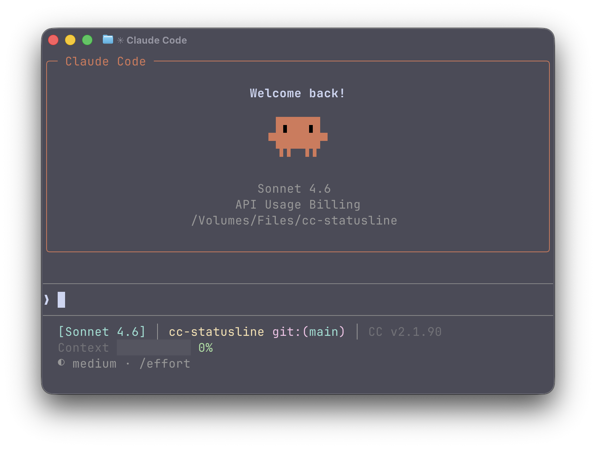

# cc-statusline

<div align="center">
  
</div>

A blazing-fast Rust implementation of statusline for Claude Code, serving as a lightweight replacement for [claude-hud](https://github.com/jarrodwatts/claude-hud).

- **⚡ Lightning Fast** - Rust implementation with instant startup
- **📦 Single Binary** - No Node.js runtime required (~600KB)
- **🔋 Battery Included** - Zero dependencies, works out of the box
- **💾 Minimal Footprint** - 100x smaller than Node.js alternatives
- **🚀 Native Performance** - Compiled binary for maximum efficiency

## Features

- Model information display (Opus/Sonnet/Haiku)
- Project path with Git status (branch + dirty indicator)
- Context window usage with visual progress bar
- Dynamic color coding (green → yellow → red)
- Claude Code version detection

## Installation

### Using Cargo

```bash
cargo install --git https://github.com/AzurIce/cc-statusline
```

### Using Nix

**Run directly without installation:**

```bash
nix run github:AzurIce/cc-statusline
```

**Install to profile:**

```bash
nix profile install github:AzurIce/cc-statusline
```

**Add to your flake:**

```nix
{
  inputs.cc-statusline.url = "github:AzurIce/cc-statusline";
  
  # In your configuration
  environment.systemPackages = [
    inputs.cc-statusline.packages.${system}.default
  ];
}
```

## Usage

After installation, configure Claude Code's statusline in your settings:

**Location**: `~/.claude/settings.json`

```json
{
  "statusLine": {
    "type": "command",
    "command": "cc-statusline"
  }
}
```

If the binary is not in your PATH, use the absolute path:

```json
{
  "statusLine": {
    "type": "command",
    "command": "/path/to/cc-statusline"
  }
}
```

A restart may be required for the changes to take effect.

## License

MIT
